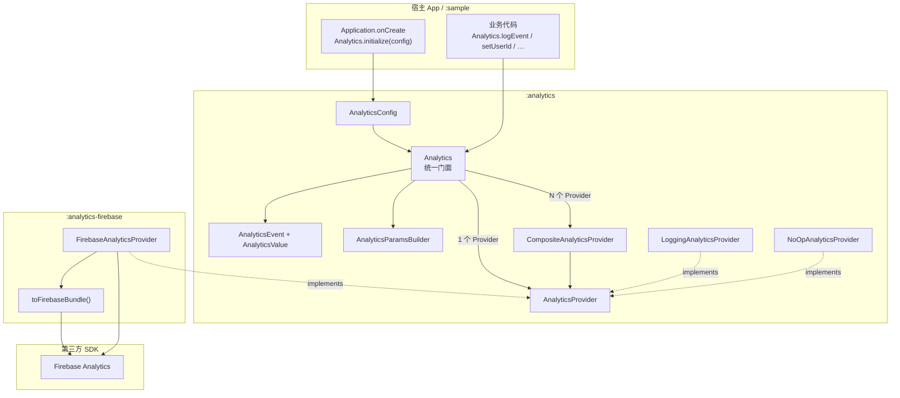
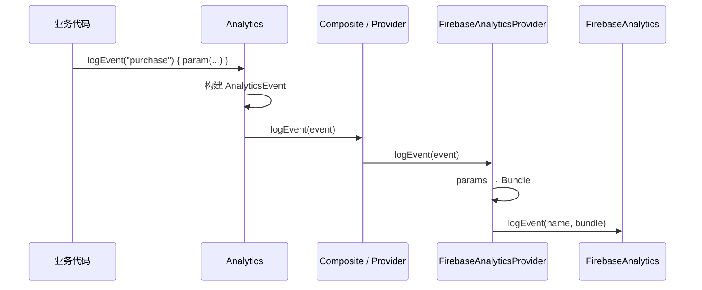

# AnalyticsKit

Android 统计封装库：业务只依赖统一 API，底层可插拔接入 Firebase Analytics 等 SDK。

## 架构



### 调用链（事件上报）



## 模块

| 模块 | 说明 |
|------|------|
| [`:analytics`](analytics/) | 核心 API、`AnalyticsProvider`、Composite / Logging / NoOp |
| [`:analytics-firebase`](analytics-firebase/) | Firebase 适配；透出 Firebase BOM |
| [`:sample`](sample/) | 示例 App（Logging + Firebase） |

## JitPack

发布：给仓库打 tag（如 `1.0.0`）并 push；JitPack 按 [`jitpack.yml`](jitpack.yml) 构建并发布库模块。

消费者 `settings.gradle.kts` / 根仓库：

```kotlin
dependencyResolutionManagement {
    repositories {
        google()
        mavenCentral()
        maven { url = uri("https://jitpack.io") }
    }
}
```

依赖：

```kotlin
dependencies {
    // 仅核心
    implementation("com.github.e-hai.AnalyticsKit:analytics:Tag")

    // 含 Firebase（会传递依赖 :analytics）
    implementation("com.github.e-hai.AnalyticsKit:analytics-firebase:Tag")
}
```

将 `Tag` 换成 git tag（如 `1.0.0`）或 commit hash。本地校验：

```bash
./gradlew :analytics:publishToMavenLocal :analytics-firebase:publishToMavenLocal
```

## 快速开始

### 1. 依赖

```kotlin
// app/build.gradle.kts — 本地工程
plugins {
    alias(libs.plugins.google.services) // 使用 Firebase 时需要
}

dependencies {
    implementation(project(":analytics-firebase"))
    // 仅核心、不接 Firebase 时：
    // implementation(project(":analytics"))
}

// 或通过 JitPack（见上一节）
```

### 2. 初始化

```kotlin
class App : Application() {
    override fun onCreate() {
        super.onCreate()
        Analytics.initialize(
            context = this,
            config = AnalyticsConfig(
                providers = listOf(
                    LoggingAnalyticsProvider(),      // 可选：Logcat
                    FirebaseAnalyticsProvider(),     // Firebase
                ),
                enabled = true,
                debug = BuildConfig.DEBUG,
            ),
        )
    }
}
```

### 3. 打点

```kotlin
Analytics.logEvent("button_click") {
    param("button_id", "checkout")
    param("value", 9.99)
    param("quantity", 1)
}

Analytics.logScreenView(screenName = "home", screenClass = "HomeActivity")
Analytics.setUserId("user_123")
Analytics.setUserProperty("vip", "true")
Analytics.setEnabled(false) // 关闭采集
Analytics.reset()           // 登出清理
```

## Firebase 配置

仓库**不再附带**可用的 `google-services.json`。原先 Quickstart 假配置（`mockproject-1234`）只能骗过本地资源注入，请求 Firebase Installations 时会报 `API_KEY_INVALID`。

要在 sample / 宿主 App 里真正跑通 Firebase：

1. 打开 [Firebase Console](https://console.firebase.google.com/) → 创建或选择项目 → 添加 Android 应用  
2. 包名填 `com.kit.analytics.sample`（或你自己的 `applicationId`）  
3. 下载 `google-services.json` 放到 app 模块根目录（sample 即 `sample/google-services.json`）  
4. 启用插件并保证包名一致：

```kotlin
plugins {
    alias(libs.plugins.google.services)
}

android {
    defaultConfig {
        applicationId = "你在控制台注册的包名"
    }
}
```

5. 注册 Provider：

```kotlin
providers = listOf(
    LoggingAnalyticsProvider(),
    FirebaseAnalyticsProvider(),
)
```

若出现 `Missing google_app_id`：插件未生效或 `applicationId` 与 json 中 `package_name` 不一致。  
若出现 `API_KEY_INVALID`：json 不是该 Firebase 项目的真实文件（或 API Key 被限制/吊销）。

## 扩展新 SDK

1. 新建模块（如 `:analytics-xxx`），`api(project(":analytics"))`。
2. 实现 `AnalyticsProvider`。
3. 在 `AnalyticsConfig.providers` 中注册；多 Provider 时门面会自动走 Composite。

```kotlin
class XxxAnalyticsProvider : AnalyticsProvider {
    override val name = "xxx"
    override fun initialize(context: Context) { /* … */ }
    override fun logEvent(event: AnalyticsEvent) { /* … */ }
    override fun setUserId(userId: String?) { /* … */ }
    override fun setUserProperty(name: String, value: String?) { /* … */ }
    override fun setAnalyticsCollectionEnabled(enabled: Boolean) { /* … */ }
}
```

## 构建注意

- 使用 **AGP 9 + 内置 Kotlin**，不要再 apply `org.jetbrains.kotlin.android`。
- 需要 **JDK 21** 运行 Gradle（AGP 9 要求）。
- 依赖版本集中在 [`gradle/libs.versions.toml`](gradle/libs.versions.toml)。

## 目录速览

```
AnalyticsKit/
├── analytics/                 # 核心库
│   └── src/main/java/com/kit/analytics/
│       ├── Analytics.kt
│       ├── AnalyticsConfig.kt
│       ├── AnalyticsEvent.kt
│       ├── AnalyticsValue.kt
│       └── provider/
├── analytics-firebase/        # Firebase 适配
│   └── src/main/java/com/kit/analytics/firebase/
├── sample/                    # 示例 App
├── AGENTS.md                  # 给 AI Agent 的仓库说明
└── README.md
```
